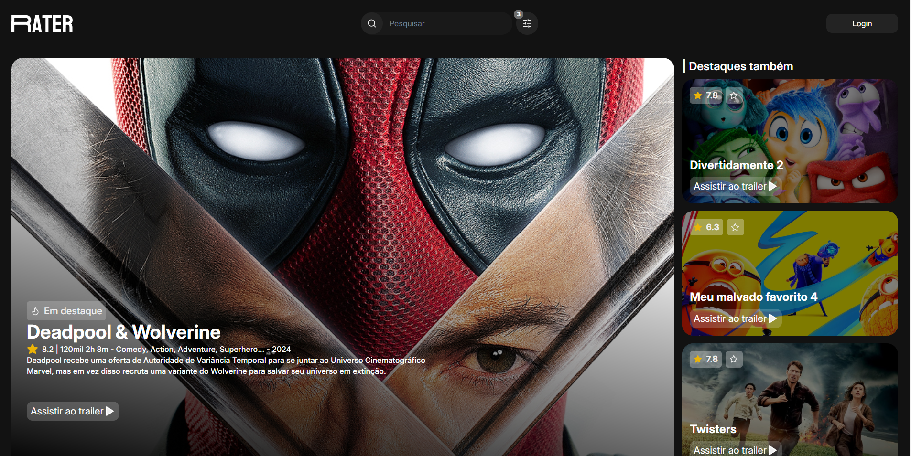

<section align="center">
  </img> 
  <h4> 👨‍💻 Em desenvolvimento 👩‍💻 </h4>
  

    <a href="#descrição">Descrição</a> •
    <a href="#contato">Contato</a> • 
    <a href="#visual">Visual</a> •
    <a href="#ferramentas">Ferramentas</a> •
    <a href="#execução-do-projeto">Execução</a> •
    <a href="#contribuição">Contribuição</a> •
    <a href="#autores">Autores</a>
  

</section>

## Descrição
Teste de desenvolvimento FullStack de uma plataforma de streaming.

## Contato
| Ícone                |  Nome             |          Descrição  |  
| :-----------------: | :-----------------: | :-----------------: |
 |  Github  | [Fernanda154](https://github.com/Fernanda154) 
 |  Gmail  | <a href="mailto:eufernandagui154@gmail.com"> Fernanda Guilherme dos Santos </a> 

## Projeto
| Ícone                |  Nome             |          Descrição  |  
| :-----------------: | :-----------------: | :-----------------: |
|   |  React |  Tecnologia utilizada no front-end | 
|   |  Typescript |  Tecnologia utilizada no front-end | 
|   |  Nest |  Tecnologia utilizada no back-end | 
 |  PostgreSQL |  SGBD utilizado no projeto | 
|   |  Swagger |  Rotas do backend disponíveis em: http://localhost:8000/swagger/ | 
|   |  Visual Studio Code |  Editor de código utilizado no projeto | 

## Visual

## Ferramentas

### Front-end
As seguintes ferramentas foram usadas na construção do front-end:

- [React](https://pt-br.reactjs.org/)
- [Node.js](https://nodejs.org/en/)
- [Typescript](https://www.typescriptlang.org/)

### Back-end
As seguintes ferramentas foram usadas na construção do back-end:

- [Nest](https://nestjs.com/)
- [Swagger](https://swagger.io/)
- [PostgresSQL](https://www.postgresql.org/)

## Autora
<table style>
  <tr>
    <td align="center"><a href="https://github.com/Fernanda154">
        
         
        <a href="https://github.com/Fernanda154"><b>Fernanda Gulherme</b></a>
    </td>
  </tr>
</table>

## Licença
For open source projects, say how it is licensed.

## Status do projeto
Incompleto